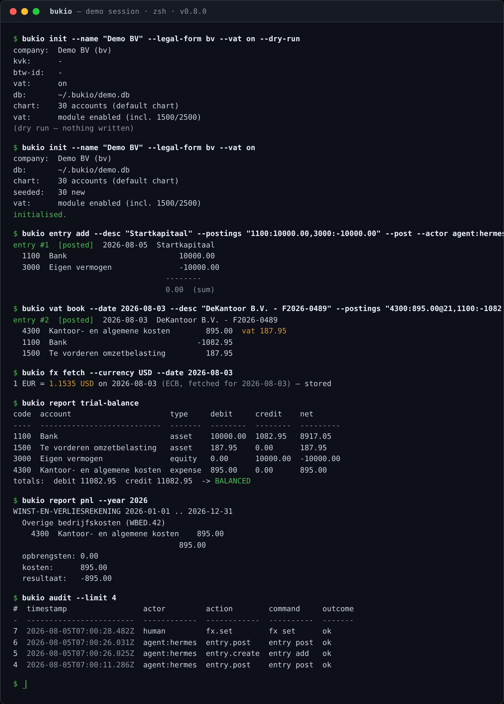

<div align="center">

# bukio-cli

**Agent-first double-entry bookkeeping for Dutch SMEs.**

VAT-optional · Peppol BIS 3.0-ready · Local-first (SQLite) · MCP-native

[](LICENSE)
[](https://github.com/erikvankempen/bukio-cli/releases)
[](package.json)
[](test/report.md)
[](https://peppol.eu/)
[](#using-agents)

</div>

bukio-cli is a double-entry bookkeeping engine and CLI that runs natively on a VPS, stores everything in one local SQLite file, and is designed so AI agents — not just humans — can operate it safely and auditably. It is built for the Dutch B2B e-invoicing mandate: every invoice ends as a compliant PDF, a Peppol BIS 3.0 UBL document, and a sendable Peppol message.

**Status: Phase 8 complete (v0.11.0)** — ledger → bank/VAT → invoicing & recurring → jaarrekening → agent layer (MCP) → imports & month-end automation → fixed assets → SEPA payment batches. Full pipeline in the [Roadmap](#roadmap).

## Features

- **Agent-native** — every command emits deterministic `--json`; every mutation supports `--dry-run` (plan mode); every action lands in an append-only audit log with named-actor attribution (`--actor agent:bartholomeus` / `human:erik`).
- **VAT optional** — the core ledger is VAT-agnostic. The optional VAT module adds codes, the OB readout (fields 1a–5d) and KOR support when you need them. Filing always stays manual — bukio never submits anything.
- **Peppol BIS 3.0 ready** — the 2027 mandate in one loop: `finalize → PDF → UBL → peppol-send`.
- **FX built in** — book foreign-currency purchase invoices in USD, GBP, …; rates resolve from your rate store or straight from the ECB.
- **Migration-ready** — `import opening-balances`, `import journal` (SnelStart/Exact-style CSV) and `import xaf` (XML Auditfile Financieel 4.0) bring a whole administration in; every importer validates the entire file before writing a single cent.
- **Runs itself** — `month-end` is the agent's close check (drafts, bank, VAT, invoices, recurring, fixed assets, profit); `invoice reminders` drafts overdue payment reminders.
- **Fixed assets** — depreciation schemes (lineair / degressief with the standard switch-to-linear rule), an asset register with **mid-life adoption** (recognition date + cumulative depreciation at recognition — only the remaining depreciation is booked), monthly runs (idempotent per asset-month), disposal with winst/verlies booking, and the **activastaat** (CSV/XLSX export).
- **SEPA payment batches** — a payables register (purchase invoices, `transfer` vs `direct_debit`/incasso), batch creation from unpaid invoices or CSV, and **pain.001 export** (`001.03`/`001.09`) for upload in any Dutch bank portal. One export per batch (unique `MsgId` — re-uploading would double-pay); the ledger is untouched until the bank statement import books the payments.
- **One company per database** — a second company is a second SQLite file (`--db` or `BUKIO_DB`).
- **Local-first** — no cloud, no lock-in. Your 7-year administration stays yours.

## Quick start

```bash
# install
git clone https://github.com/erikvankempen/bukio-cli.git
cd bukio-cli && npm install && npm link        # exposes `bukio` on PATH

# create a company (dry-run first — it writes nothing)
bukio init --name "Demo BV" --kvk 12345678 --legal-form bv --vat on --dry-run
bukio init --name "Demo BV" --kvk 12345678 --legal-form bv --vat on

# post the opening capital, book an expense, check the books
bukio entry add --date 2026-08-04 --desc "Startkapitaal" \
  --postings "1100:10000.00,3000:-10000.00" --post
bukio entry add --date 2026-08-05 --desc "Kantoorartikelen" \
  --postings "4300:250.00,1100:-250.00" --post
bukio report trial-balance        # → balanced: true
```

Or let an agent do it — `bukio mcp` speaks the Model Context Protocol over stdio:

```bash
printf '%s\n' \
  '{"jsonrpc":"2.0","id":1,"method":"initialize","params":{}}' \
  '{"jsonrpc":"2.0","id":2,"method":"tools/call","params":{"name":"trial_balance","arguments":{}}}' \
| bukio mcp
```

## Screenshot

<p align="center">
  
</p>

## Table of Contents

1. [Features](#features)
2. [Quick start](#quick-start)
3. [Screenshot](#screenshot)
4. [Requirements & Install](#requirements--install)
5. [Core Concepts](#core-concepts)
6. [Command Reference](#command-reference)
7. [Global Flags](#global-flags)
8. [Money Format](#money-format)
9. [Integrity & Safety Model](#integrity--safety-model)
10. [The Database](#the-database)
11. [Using Agents](#using-agents)
12. [Scheduling recurring actions (cron)](#scheduling-recurring-actions-cron)
13. [Project Layout](#project-layout)
14. [Development & Testing](#development--testing)
15. [Error Codes](#error-codes)
16. [Common Tasks](#common-tasks)
17. [Roadmap](#roadmap)

---

## Requirements & Install

- Node.js **>= 20**
- Linux/macOS (developed on a Linux VPS)

```bash
git clone https://github.com/erikvankempen/bukio-cli.git
cd bukio-cli
npm install          # deps: better-sqlite3, commander
npm link             # exposes `bukio` on PATH (or: npm install -g .)
bukio --version
```

Uninstall: `npm unlink -g bukio-cli` (or `npm uninstall -g bukio-cli`).

---

## Core Concepts

### Double-entry bookkeeping

Every **journal entry** contains two or more **postings** (debits and credits) whose amounts sum to **zero**. Positive amounts are debits, negative amounts are credits. This invariant is enforced by the engine at creation time *and* by a database trigger when an entry is posted — an unbalanced posted entry is impossible.

### Accounts and the chart of accounts

Accounts are organised in a **chart of accounts** with 4-digit codes and a type:

| Type | Normal balance | Examples |
|------|----------------|----------|
| `asset` | debit | 1000 Kas, 1100 Bank, 1200 Debiteuren |
| `liability` | credit | 2000 Crediteuren, 2100 Overige schulden |
| `equity` | credit | 3000 Eigen vermogen |
| `expense` | debit | 4000 Inkoopwaarde, 4100–4500 kosten |
| `income` | credit | 8000 Omzet, 8100 Overige opbrengsten |

`bukio init` seeds a minimal default chart (14 accounts, no VAT accounts — the core is VAT-agnostic). The full RGS (Referentie Grootboekschema) taxonomy import arrives in Phase 1; account codes are RGS-compatible in structure.

### Entry lifecycle

```
draft ──post──▶ posted ──reverse──▶ (original stays posted)
  │                                  + contra-entry posted (negated postings)
  └──reverse── (not allowed)          + audit trail
```

- **draft** — a work-in-progress entry. Postings can be added/changed/removed (via SQL or future commands). Drafts are excluded from reports.
- **posted** — final. Postings are immutable (database trigger). Posted entries appear in the trial balance.
- **reverse** — reversing a posted entry **posts a linked contra-entry** with negated postings. The original entry *stays posted* — the contra-entry cancels it, so the net effect on the books is zero. Linkage: the contra-entry's `reversed_from_id` points at the original; the audit log records the action. Posted entries are **never deleted** — they are reversed.

### Actors

Every mutation records an **actor** — every command requires a named identity in the form `'<role>:<name>'`: `human:erik` when you act yourself, `agent:bartholomeus` when an agent acts. A bare `human` or `agent` is rejected. Actors appear on entries (`created_by`) and in the audit log, so a human can always see exactly what an agent did.

### The audit log

An **append-only** log of every mutation: actor, action, command, JSON args, outcome, and affected entry IDs. Database triggers block UPDATE and DELETE — the log cannot be rewritten after the fact. Read it with `bukio audit`.

### Amounts

All money is stored as **integer cents** (`amount_cents`). There are no floats anywhere in financial code paths. See [Money Format](#money-format).

---

## Command Reference

Global flags (`--json`, `--db`, `--actor`) can appear before or after the subcommand. See [Global Flags](#global-flags).

### `bukio init`

Initialise a company database: creates the file, the company row, and seeds the default chart of accounts.

| Option | Default | Description |
|--------|---------|-------------|
| `--name <name>` | *(required)* | Company name |
| `--kvk <kvk>` | — | KVK number |
| `--legal-form <form>` | `eenmanszaak` | `eenmanszaak` \| `vof` \| `bv` \| `nv` \| `stichting` \| `vereniging` |
| `--btw-id <id>` | — | BTW identification number |
| `--iban <iban>` | — | Bank account (IBAN) |
| `--vat <on\|off>` | `off` | Enable the VAT module (Phase 2) |
| `--kor` | off | Small business scheme — implies `--vat off` |
| `--fiscal-year-end <mm-dd>` | `12-31` | Fiscal year end |
| `--dry-run` | off | Show the plan without writing anything |

Fails with `ALREADY_INITIALISED` if the database already has a company.

```bash
bukio init --name "Demo BV" --kvk 12345678 --legal-form bv --vat on --dry-run
bukio init --name "Demo BV" --kvk 12345678 --legal-form bv --vat on
```

### `bukio entry add`

Create a journal entry (draft by default; `--post` posts it immediately).

| Option | Default | Description |
|--------|---------|-------------|
| `--date <yyyy-mm-dd>` | today | Entry date (ISO) |
| `--desc <description>` | *(required)* | Description |
| `--postings <CODE:AMOUNT>` | *(required)* | Posting spec — **repeat the flag or comma-separate**; positive = debit, negative = credit |
| `--source <source>` | `manual` | `manual` \| `bank` \| `invoice` \| `agent` |
| `--source-ref <ref>` | — | Source reference (e.g. invoice number) |
| `--post` | off | Post immediately (draft → posted) |
| `--dry-run` | off | Validate and show the plan without writing |

```bash
# two postings, comma-separated
bukio entry add --date 2026-08-04 --desc "Startkapitaal" \
  --postings "1100:10000.00,3000:-10000.00" --post

# equivalent: repeated flag
bukio entry add --desc "Startkapitaal" \
  --postings "1100:10000.00" --postings "3000:-10000.00"

# three postings (VAT-like split is a Phase 2 concern; 3-leg entries work today)
bukio entry add --desc "3-leg example" \
  --postings "1100:121.00,8000:-100.00,2100:-21.00" --dry-run
```

Validation errors (see [Error Codes](#error-codes)): `INVALID_POSTING`, `INVALID_AMOUNT`, `INVALID_DATE`, `INVALID_DESCRIPTION`, `TOO_FEW_POSTINGS`, `UNBALANCED`, `ACCOUNT_NOT_FOUND`, `ACCOUNT_INACTIVE`, `INVALID_AMOUNT_CENTS`, `INVALID_SOURCE`.

### `bukio entry post`

Post a draft entry (draft → posted).

| Option | Default | Description |
|--------|---------|-------------|
| `--id <id>` | *(required)* | Entry id |
| `--dry-run` | off | Show the plan without writing |

The database trigger backstops the invariant: an entry needs **>= 2 postings summing to zero** before it can be posted.

### `bukio entry reverse`

Reverse a posted entry: **posts a linked contra-entry** with negated postings. The original stays posted; the contra-entry cancels it (net effect zero). See [Core Concepts](#core-concepts).

| Option | Default | Description |
|--------|---------|-------------|
| `--id <id>` | *(required)* | Entry id |
| `--reason <text>` | — | Reason, appended to the contra-entry description |
| `--dry-run` | off | Show the planned contra-entry without writing |

Fails with `NOT_POSTED` for drafts and `ALREADY_REVERSED` if a posted reversal already exists.

```bash
bukio entry reverse --id 2 --reason "verkeerde categorie" --dry-run
bukio entry reverse --id 2 --reason "verkeerde categorie"
```

### `bukio entry list`

List journal entries (newest first).

| Option | Default | Description |
|--------|---------|-------------|
| `--state <state>` | all | `draft` \| `posted` \| `reversed` |
| `--date-from <yyyy-mm-dd>` | — | Earliest date (inclusive) |
| `--date-to <yyyy-mm-dd>` | — | Latest date (inclusive) |
| `--limit <n>` | `100` | Max rows |

### `bukio entry show`

Show one entry with its full postings.

| Option | Default | Description |
|--------|---------|-------------|
| `--id <id>` | *(required)* | Entry id |

### `bukio report trial-balance`

Per-account debit/credit/net totals from **posted** entries, with a final BALANCED/UNBALANCED verdict. Drafts and the mirror of reversed entries behave per the lifecycle rules (drafts excluded; contra-entries included — that's what makes reversals net to zero).

| Option | Default | Description |
|--------|---------|-------------|
| `--year <yyyy>` | all years | Filter by year |
| `--format <format>` | human (json with `--json`) | `json` \| `csv` \| `xlsx` \| `human` |
| `--out <path>` | stdout | Output file (required for xlsx) |

### `bukio report balans`

Balance sheet as of a date, grouped by RGS hoofdgroep (Materiële vaste activa, Voorraden, Vorderingen, Liquide middelen / Eigen vermogen, Kortlopende schulden, …). Includes the computed **Nog te verdelen resultaat** (net result of income/expense accounts). Invariant: **total assets = total liabilities + equity + result** — the report says `BALANCED` or `UNBALANCED!`.

| Option | Default | Description |
|--------|---------|-------------|
| `--as-of <yyyy-mm-dd>` | today | Balance date (inclusive) |
| `--format <format>` | human (json with `--json`) | `json` \| `csv` \| `xlsx` \| `human` |
| `--out <path>` | stdout | Output file (required for xlsx) |

### `bukio report pnl`

Winst- en verliesrekening for a period, grouped by RGS hoofdgroep (Omzet, Inkoopwaarde van de omzet, Personeelskosten, Afschrijvingen, Overige bedrijfskosten, Financiële baten en lasten, …). Reports revenue, costs and **Netto resultaat**.

| Option | Default | Description |
|--------|---------|-------------|
| `--year <yyyy>` | current year | Fiscal year (sets from/to) |
| `--from <yyyy-mm-dd>` | year start | Period start (inclusive) |
| `--to <yyyy-mm-dd>` | year end | Period end (inclusive) |
| `--format <format>` | human (json with `--json`) | `json` \| `csv` \| `xlsx` \| `human` |
| `--out <path>` | stdout | Output file (required for xlsx) |

### `bukio report journal`

Journal export — one row per posting with account info, for a period. Ideal for handing to your boekhouder.

| Option | Default | Description |
|--------|---------|-------------|
| `--year <yyyy>` | current year | Fiscal year (sets from/to) |
| `--from <yyyy-mm-dd>` | year start | Period start (inclusive) |
| `--to <yyyy-mm-dd>` | year end | Period end (inclusive) |
| `--format <format>` | human (json with `--json`) | `json` \| `csv` \| `xlsx` \| `human` |
| `--out <path>` | stdout | Output file (required for xlsx) |

```bash
bukio report balans --as-of 2026-12-31
bukio report pnl --year 2026 --format xlsx --out ~/exports/pnl-2026.xlsx
bukio report journal --year 2026 --format csv --out ~/exports/journal-2026.csv
```

### `bukio account`

Chart of accounts management.

| Command | Purpose |
|---------|---------|
| `account add --code <c> --name <n> --type <t> --normal-balance <d\|c> [--rgs-code <r>] [--dry-run]` | Add an account |
| `account list [--type <t>] [--include-inactive]` | List accounts |
| `account show --code <c>` | Show one account |
| `account deactivate --code <c>` | Deactivate (blocks new postings; history stays) |
| `account reactivate --code <c>` | Reactivate |
| `account import --file <chart.csv> [--dry-run]` | Import a chart from CSV: `code,name,type,normal_balance[,rgs_code]` |

The bundled default chart lives at `assets/chart-nl.csv` — you can import it (or your own) into any database:

```bash
bukio account import --file assets/chart-nl.csv --dry-run   # validate first
bukio account import --file assets/chart-nl.csv
```

### `bukio bank`

Bank accounts, import and matching.

| Command | Purpose |
|---------|---------|
| `bank add --iban <IBAN> [--name] [--account-code 1100]` | Register a bank account (links to a ledger account) |
| `bank list` | Accounts with balance, transaction and unmatched counts |
| `bank import --file <path> --iban <IBAN> [--format camt\|csv\|auto] [--dry-run]` | Import transactions — **CAMT.053 XML** or bank CSV (Rabo/ING/ABN column aliases, Dutch `1.234,56` amounts, Af/Bij sign). Idempotent via SHA-256 hash. |
| `bank transactions [--iban] [--state unmatched\|matched\|ignored] [--limit]` | List transactions |
| `bank match auto [--window-days 5] [--dry-run]` | Auto-match unmatched transactions to posted entries (exact ≤ 2 days, fuzzy ≤ window) |
| `bank match suggest` | Unmatched transactions with a proposed posting (income → 8000, expense → 4300) |
| `bank match link --tx <id> --entry <id> [--method]` | Link a transaction to an existing posted entry |
| `bank match post --tx <id> --account <code> [--dry-run]` | Post a new entry from an unmatched transaction (bank leg + counter leg), reconciled automatically |
| `bank ignore --tx <id>` / `bank unignore --tx <id>` | Ignore/re-open a transaction (e.g. transfers between own accounts) |

The **bank balance vs ledger balance check** is the reconciliation test: after matching everything, `bank list` balance should equal the ledger account balance in the trial balance.

### `bukio vat`

Optional VAT module (per company; KOR companies cannot enable it).

| Command | Purpose |
|---------|---------|
| `vat enable [--dry-run]` | Enable the module: accounts 1500 (te vorderen) + 2500 (te betalen), 8 VAT codes |
| `vat codes` | List VAT codes (21, 9, 0, V vrijgesteld, R/RE verlegd, M marge, P privé) |
| `vat book --date --desc --postings "1100:121.00,8000:-100.00@21" [--post] [--dry-run]` | Book a VAT-aware entry. `@CODE` tags a posting as net; the VAT amount and the VAT ledger leg (2500/1500) are computed automatically. |
| `vat readout --period 2026-Q2 [--mark-filed]` | **OB-aangifte manual-filing readout** — fields 1a–5d for the period (quarter `YYYY-Qn` or month `YYYY-MM`). bukio never files; you enter these amounts in Mijn Belastingdienst Zakelijk. `--mark-filed` records the filing. |

```bash
# sale: 121.00 incl 21% -> omzet 100 + te betalen btw 21
bukio vat book --date 2026-06-01 --desc "Factuur 2026-001" \
  --postings "1100:121.00,8000:-100.00@21" --post

# purchase: 60.50 incl 21% -> kosten 50 + te vorderen btw 10.50
bukio vat book --date 2026-06-05 --desc "Kantoorartikelen" \
  --postings "4300:50.00@21,1100:-60.50" --post

# quarterly manual filing aid
bukio vat readout --period 2026-Q2
```

**OB field mapping:** 1a/1b/1c omzet (21%/9%/0%/vrijgesteld), 1d privégebruik, 3a/3b/3c inkopen, 4a/4b verlegde btw (binnenland/EU, netted via 5b), 5a verschuldigde btw, 5b voorbelasting, 5d te betalen/te ontvangen. Fields 2a/2b (exports) and 5c are not tracked in Phase 2 (shown as 0).

### `bukio recurring` / `bukio depreciation`

Recurring entries & period automation (FR3A) — deterministic, dry-run first, fully audited. Templates are validated at creation; generation just replays them. bukio never generates entries on its own: the agent or a cron job triggers `run --due`.

| Command | Purpose |
|---------|---------|
| `recurring add --name N --postings "CODE:AMT,..." --frequency monthly\|quarterly\|yearly --start YYYY-MM-DD [--day 1-28] [--end] [--runs] [--reverse-previous] [--dry-run]` | Create a recurring **entry** template (VAT-aware via `@CODE` tags; expanded at creation) |
| `recurring add --name N --kind invoice --contact N --lines "2x DESC @ PRICE @21" --frequency monthly --start YYYY-MM-DD [--due-days 30]` | Create a **subscription invoice** template — each run generates a DRAFT invoice (never auto-finalizes; the agent finalizes) |
| `recurring list [--status active\|paused\|completed\|all]` / `show --id` | Inspect templates |
| `recurring pause --id` / `resume --id` | Control scheduling |
| `recurring preview [--as-of DATE] [--template ID]` | What is due (read-only plan) |
| `recurring run [--as-of DATE] [--template ID] [--dry-run]` | Generate all due entries/invoice drafts — **backfills missed periods**, idempotent, one transaction per template (a failing template is reported and skipped, others still run) |
| `depreciation add --name N --cost C --life-months M --start DATE [--asset 1800] [--expense 4600] [--residual 0] [--dry-run]` | Linear monthly depreciation with a **remainder-adjusted final run** (cents-exact total over the asset life) |

**Semantics:**
- Generated entries: `source='recurring'`, `source_ref='tpl:<id>'`, `created_by='recurring'` (the trigger actor is in the audit log). Posted, immutable, reversible like any entry.
- `--reverse-previous` implements the accrual pattern: each run first reverses the previous generated entry (contra-entry dated at the original), then books the new one — monthly estimates replace cleanly, each month carries its own amount.
- `--runs` / `--end` complete the template (status `completed`); a completed template cannot be re-activated.
- First run is normalized to `--day` (never backwards); days 29–31 are rejected to avoid month-end clamping.

```bash
# depreciation: 5370.00 over 36 months -> 149.17/mo, final 149.05 (total exactly 5370.00)
bukio depreciation add --name "Laptop Dell" --cost 5370.00 --life-months 36 --start 2026-08-01
# accrual with auto-reversal (nog te betalen kosten, monthly estimates)
bukio recurring add --name "Nog te betalen kosten admin" \
  --postings "4310:250.00,2400:-250.00" --frequency monthly --start 2026-08-31 --day 28 --reverse-previous
# prepaid spreading: annual insurance over 12 months
bukio recurring add --name "Verzekering 12 mnd" \
  --postings "4320:100.00,1700:-100.00" --frequency monthly --start 2026-08-01 --runs 12
# the agent's month-end: preview, then run
bukio recurring preview --as-of 2026-09-30
bukio recurring run --as-of 2026-09-30
# subscription invoices: run generates DRAFT invoices, then the agent finalizes
bukio recurring add --name "SaaS abonnement" --kind invoice --contact 1 \
  --lines "2x Premium SaaS @ 99.00 @21" --frequency monthly --start 2026-08-01 --due-days 14
bukio recurring run --as-of 2026-10-31        # -> draft invoices 2026-08/09/10
bukio invoice finalize --id 1                 # -> 2026-0001, booked
bukio invoice peppol-send --id 1 --dry-run    # Peppol access-point (env creds)
```

### `bukio contact` / `bukio invoice`

Outgoing invoicing (FR3) — compliant with the 12 verplichte factuurvereisten, lifecycle draft → sent → paid (overdue derived), credit notes, PDF + UBL export, bank payment matching.

| Command | Purpose |
|---------|---------|
| `contact add --name N [--address] [--postal-code] [--city] [--vat-id] [--kvk] [--email]` | Add a customer (vat-id required when btw verlegd) |
| `contact list` | List contacts |
| `invoice create --contact <id> --lines "2x Consultancy @ 150.00 @21,1x Rapportage @ 400.00 @9" --date YYYY-MM-DD [--due-days 30] [--reference] [--dry-run]` | Create a draft invoice (line spec: `[QTYx] DESC @ PRICE [@ VATCODE]`) |
| `invoice finalize --id N [--dry-run]` | **Assign the sequential number (YYYY-NNNN) and book the entry** (Debiteuren / Omzet / Te betalen btw) |
| `invoice list [--status] [--type]` / `show --id` | Inspect invoices |
| `invoice pdf --id N [--out PATH]` | Render a compliant PDF via headless Chromium |
| `invoice ubl --id N [--out PATH]` | Export **UBL 2.1 / Peppol BIS 3.0 (EN 16931)** XML |
| `invoice credit --id N [--reason]` | Create a credit note (draft) from a finalized invoice |
| `invoice pay --id N --date [--amount]` | Record a payment (tracking; the posting comes from the bank flow) |

**Compliance (validated at finalize):** supplier name/KvK/btw-id/address/postal/city (set at `init`), invoice date, sequential number, customer name+address+city, line descriptions/quantities/prices, VAT rate + amount per rate, totals, and the customer's btw-id when a line carries `@R`/`@RE` (btw verlegd). Missing data fails with `SUPPLIER_INCOMPLETE` / `CUSTOMER_INCOMPLETE` / `CUSTOMER_VAT_REQUIRED`.

**Payment matching:** `bank match auto` now recognizes incoming payments against unpaid sales invoices (exact outstanding amount, oldest due first) — it marks the invoice paid, posts Bank/Debiteuren, and reconciles the transaction. The OB readout picks up invoiced sales automatically.

```bash
bukio invoice create --contact 1 --date 2026-07-10 \
  --lines "2x Consultancy @ 150.00 @21,1x Rapportage @ 400.00 @9" --reference "PO-2026-88"
bukio invoice finalize --id 1 --dry-run      # plan: number + postings
bukio invoice finalize --id 1                # -> 2026-0001, entry posted
bukio invoice pdf --id 1                     # 2026-0001.pdf
bukio invoice ubl --id 1                     # 2026-0001.xml (Peppol BIS 3.0)
# payment arrives -> the bank import matches it automatically
bukio bank import --file stmt.xml --iban NL91ABNA0417164300
bukio bank match auto                        # tx -> invoice 2026-0001 (paid)
```

### `bukio year-end` / `bukio jaarrekening` / `bukio icp`

Annual close and statutory reporting (Phase 4).

| Command | Purpose |
|---------|---------|
| `year-end status --year YYYY` | Open/closed, the year's result, per-account nets |
| `year-end close --year YYYY [--dry-run]` | **Close the fiscal year**: reverse income/expense into 9900 (created on demand), then resultaatbestemming into 3000. Both entries `source='closing'`, `source_ref='fy:YYYY'`. Guards: draft entries in the year (`INCOMPLETE_YEAR`), double close (`ALREADY_CLOSED`), no activity (`EMPTY_YEAR`). **The P&L report excludes closing entries** — the year's flow stays visible after closing; the balans then shows equity including the result |
| `jaarrekening report --year YYYY --model micro\|klein [--format json\|pdf\|xlsx] [--out]` | Statutory annual accounts in the Dutch layout (Titel 9 Boek 2 BW): balans (vaste activa / vlottende activa / eigen vermogen / voorzieningen / lang- en kortlopende schulden) + W&V (klein model). `--format pdf` = the **KVK deposit package**; xlsx for the accountant |
| `icp readout --period YYYY-Qn` | **ICP listing**: EU btw-verlegde supplies per customer (from RE invoice lines), with their btw-ids. Fails `ICP_VAT_ID_MISSING` if a customer lacks one. Credit notes reduce the customer total |

```bash
bukio year-end status --year 2026
bukio year-end close --year 2026 --dry-run     # plan: result 1254.15 + postings
bukio year-end close --year 2026               # entries #9 #10 posted
bukio jaarrekening report --year 2026 --model klein        # JSON
bukio jaarrekening report --year 2026 --model klein --format pdf   # jaarrekening-2026-klein.pdf (KVK)
bukio icp readout --period 2026-Q3             # EU customers + amounts
```

**OB readout fields (Phase 4):** 1a/1b/1c omzet (21%/9%/0%-vrijgesteld), 1d privégebruik (21% auto-computed on `@P`), **2a verlegde EU leveringen (RE)**, 3a inkopen binnenland (incl. verlegd `@R`), **3b inkopen EU (RE)**, 3c buiten EU, 4a/4b verlegde btw, 5a verschuldigd, 5b voorbelasting, 5d te betalen/te ontvangen. 2b and 5c are not tracked.

### `bukio mcp` / `bukio fx` / `bukio compliance`

The agent layer (Phase 5).

| Command | Purpose |
|---------|---------|
| `mcp` | **MCP server over stdio** (JSON-RPC 2.0, newline-delimited): `company_info`, `trial_balance`, `balans`, `pnl`, `journal`, `accounts`, `vat_readout`, `icp_readout`, `audit`, `compliance`, `invoices` (read-only) + `entry_add/post/reverse`, `vat_book`, `invoice_create/finalize/credit/pay`, `recurring_run`, `year_end_close`, `fx_set`, `contact_add` (mutations). **Mutations are plan-only unless `mode:"execute"`**; `BUKIO_MCP_READONLY=1` blocks execution entirely. Every execute books with the caller's `actor` and lands in the audit log. NL query = an agent on top of these tools |
| `fx set --currency USD --date D --rate 1.0875` | Store a rate (1 EUR = N units of foreign currency, 4 decimals max). Upsert; audited |
| `fx fetch --currency USD [--date D]` | **Fetch the ECB reference rate** (free, no key) for a currency on/before a date and store it (source `ECB`). Weekends/holidays fall back to the last business day; unknown currency or pre-1999 → `ECB_RATE_NOT_AVAILABLE` |
| `entry add / vat book --currency USD [--rate R]` | **Foreign-currency purchase invoices**: spec amounts are in the foreign currency, converted to EUR (round-half-up) at booking; the rate is auto-looked-up (exact date, else latest on/before) when `--rate` is omitted. **Missing rates are fetched live from the ECB** and stored for reuse — one network call ever per currency/date. The ledger stores EUR; each posting keeps `fx_currency`/`fx_amount_cents` (the original amount) — reversals negate both. VAT legs are computed on the EUR amounts. `BUKIO_FX_NO_FETCH=1` disables the network fallback (offline/air-gapped use) |
| `compliance status --year YYYY` | OB + ICP quarterly deadlines and the jaarrekening deposit (13 months after FY end, art. 2:394 BW) with filed/open/overdue status; `compliance mark --type ICP\|JAARREKENING --period ...` records a filing (OB uses `vat readout --mark-filed`) |

### `bukio import` / `bukio month-end` / `bukio invoice reminders`

Imports & period automation (Phase 6).

**Every importer validates the ENTIRE file before writing anything** — all
errors are collected and reported with line numbers (`IMPORT_VALIDATION_FAILED`
+ `details`), and the file is rejected as a whole when anything is wrong.
Imports are idempotent: re-running skips already-imported boekstukken.

| Command | Purpose |
|---------|---------|
| `import opening-balances --file <csv> [--date yyyy-mm-dd] [--dry-run]` | Import opening balances as ONE posted `Beginbalans` entry. CSV: `code,amount` (signed; + = debet) or `code,debet,credit` (Dutch layout). Amounts accept `1234.56`, `1234,56` and `1.234,56`. Sum must be zero. Re-import → `OPENING_ALREADY_IMPORTED` |
| `import journal --file <csv> [--create-missing] [--dry-run]` | Import a journal from SnelStart/Exact-style CSV: header `datum,boekstuknummer,rekening,tegenrekening,bedrag[,omschrijving][,btwcode]` (aliases + `;` delimiter supported). Each row books `+bedrag` on rekening / `−bedrag` on tegenrekening; rows per boekstuknummer become ONE posted entry (`source='import'`, `source_ref='journal:<nr>'`). `--create-missing` creates unknown accounts (type inferred from net movement). BtwCode columns are reported in `ignored_btw_codes` but not booked |
| `import xaf --file <audit.xaf> [--dry-run]` | Import an **XML Auditfile Financieel 4.0** — both the Belastingdienst layout (`Xaf`/`Rekeningen`/`Mutaties`) and the generic AuditFile layout (`AuditFile`/`Header`/`MasterFiles`/`GeneralLedgerEntries`, explicit debit/credit lines): the file's chart is upserted (types from `AccountType`/`RekeningSoort`), each Mutatie/Transaction becomes one posted entry (`source='xaf'`, `source_ref=<boekstuk/transaction>`). A differing company KVK → `COMPANY_MISMATCH` (name differences are warnings). **On an empty ledger the file's chart is authoritative**: colliding account codes are renamed to the file's meanings (listed in the dry-run as `accounts_to_rename`, reported as `accounts_updated` after import); accounts that already carry postings are never touched |
| `month-end --period yyyy-mm` | **Read-only close check**: draft entries, unmatched bank transactions, the OB readout for the containing quarter, draft + overdue invoices (with outstanding total), due recurring templates, period debit/credit totals (`balanced`), the month's profit, and human-readable `warnings` — the agent's monthly "can I close?" report |
| `import contacts --file <audit.xaf> [--dry-run]` | Import **suppliers + customers** from an audit file (either XAF layout) as invoice contacts: name, street, postal code, city, country, email, vat-id. Whole-file validation (every entry needs a name); idempotent by name |
| `invoice reminders [--within-days N] [--draft-emails]` | Overdue + due-soon sales invoices, sorted most-overdue first, with `outstanding` per invoice. `--draft-emails` adds a Dutch reminder email draft (`to`/`subject`/`body`) per invoice — nothing is ever sent |
| `assets scheme add --name [--method lineair\|degressief] [--life-months 60] [--residual-bp 0]` | Create a depreciation scheme. Default scheme (created lazily): **5 years lineair, monthly, 0% residual** |
| `assets add --name --purchase-date --purchase-price --depreciation-start --recognition-date [--cum-dep] [--scheme] [--asset-account 1800] [--cum-dep-account] [--expense-account 4600] [--entry-id] [--category] [--serial] [--residual]` | Register an **already-booked** asset: only the *remaining* depreciation is booked from the recognition date (first run on the 1st). GL reconciliation warnings, never blockers |
| `assets run [--period yyyy-mm \| --as-of DATE] [--dry-run]` | Book due depreciation runs — `source='assets'`, idempotent per asset-month, auto-completes assets at the residual |
| `assets register [--as-of DATE] [--format json\|csv\|xlsx --out]` | The **activastaat**: cost, cumulative depreciation, book value per asset + totals |
| `assets dispose --id N --date [--proceeds] [--bank-account 1100] [--result-account 8100] [--dry-run]` | Dispose (sale or scrap): proposes the full entry (bank / cum-dep / asset / winst-verlies), status → `disposed` |
| `assets list [--status]` / `show --id` / `pause --id` / `resume --id` | Register inspection + depreciation pause/resume |
| `payments payables add --contact N --ref --date --amount [--due] [--method transfer\|direct-debit] [--entry-id]` | Register a purchase invoice (payable). `direct-debit` = incasso, excluded from batches | 
| `payments payables list [--status] [--method]` / `pay --id` | Open payables (unpaid / in_batch / paid); mark paid after the bank statement confirms |
| `payments batch create [--from-invoices] [--payable ids] [--lines "C:AMT[:REF];…"] [--csv file] [--date] [--from-iban] [--dry-run]` | Build a batch from unpaid transfer payables and/or explicit lines; whole-set validation (IBAN mod-97, amounts, refs) |
| `payments batch export --id N [--schema 001.03\|001.09] [--out file.xml] [--dry-run]` | Export **pain.001** SEPA XML for bank-portal upload. Once per batch (unique `MsgId` — re-export would double-pay) |
| `payments batch list [--status]` / `show --id` / `delete --id` | Batch tracking; delete only allowed on drafts (releases payables back to unpaid) |
| `contact update --id N [--iban] [--address] …` / `contact add --iban` | Contact IBANs (mod-97 validated) — required to include a vendor in a batch |
| `export xaf --year yyyy --out <file.xaf>` | Export the fiscal year as an **Auditfile Financieel 4.0 XML** (Belastingdienst standard) — the file a boekhouder, tax advisor or auditor imports directly into SnelStart/Exact. One `<Mutatie>` per **posted** entry (drafts excluded); postings as `<Boeking>` debet/credit pairs that re-import losslessly. Records an `export.xaf` audit row; read-only |

```bash
# switching from your old package in one morning:
bukio import opening-balances --file beginbalans.csv --date 2026-01-01
bukio import journal --file snelstart-export.csv --create-missing
bukio import xaf --file audit.xaf                      # the Belastingdienst format
# let an agent run the close every month:
bukio month-end --period 2026-08
bukio invoice reminders --within-days 7 --draft-emails
# hand the year to your boekhouder / tax advisor / auditor:
bukio export xaf --year 2026 --out ~/exports/bukio-2026.xaf
bukio audit --format xlsx --out ~/exports/bukio-audit-2026.xlsx --limit 1000
```

**Import validation notes:** amounts accept the international form (`1234.56`)
and Dutch bookkeeping notation (`1234,56`, `1.234,56`); `;`-delimited files
split on `;` (decimal commas stay intact), otherwise on `,`. Journal lines
without a boekstuknummer, rows on different dates within one boekstuk, unknown
accounts (without `--create-missing`), and unbalanced opening balances all
reject the file with per-line `details`.

```bash
bukio fx set --currency USD --date 2026-07-03 --rate 1.0875
bukio fx fetch --currency GBP --date 2026-08-03          # ECB reference rate, stored
bukio vat book --date 2026-08-01 --desc "Stripe (USD)" --currency USD \
  --postings "4300:895.00@21,1100:-1082.95" --post      # 779.28 EUR — rate auto-fetched from the ECB
# koersverschil at payment: book the difference on 4700 (created on demand)
bukio account add --code 4700 --name "Koersverschillen" --type expense --normal-balance debit
printf '%s\n' \
  '{"jsonrpc":"2.0","id":1,"method":"initialize","params":{}}' \
  '{"jsonrpc":"2.0","id":2,"method":"tools/call","params":{"name":"entry_add","arguments":{"date":"2026-07-31","description":"Huur","postings":["4300:800.00","1100:-800.00"],"mode":"execute","actor":"agent:hermes"}}}' \
| bukio mcp           # or wire it into an MCP client (Hermes, Claude Code, ...)
bukio compliance status --year 2026
```

**FX booking rules:** amounts in posting specs are foreign currency; the rate
resolves as `--rate` → stored rate (exact, else latest on/before) → **ECB
reference rate** (fetched live, stored as source `ECB` for reuse). `--rate`
always wins; `BUKIO_FX_NO_FETCH=1` keeps bukio fully offline. The description
should note the currency and the original invoice number. Outgoing invoices
stay EUR-only (the 12-vereisten and UBL are EUR-based).

### `bukio backup` / `bukio restore`

| Command | Purpose |
|---------|---------|
| `backup [--out <path>]` | Consistent SQLite backup (default `~/.bukio/backups/bukio-<ts>.db`) |
| `restore --from <file> [--to <path>] [--force]` | Restore from a backup file (validated first) |

`restore` refuses to overwrite an existing initialised database unless `--force` is given, and refuses `--from`/`--to` pointing at the same file.

```bash
bukio backup
bukio restore --from ~/.bukio/backups/bukio-2026-08-04T12-00-00.db --to ~/.bukio/restored.db
```

### `bukio audit`

Read the append-only audit log (newest first).

| Option | Default | Description |
|--------|---------|-------------|
| `--since <iso-ts>` | — | Only entries at/after this timestamp (ISO 8601) |
| `--by <who>` | all | Only entries by this actor (e.g. `agent:hermes`) |
| `--limit <n>` | `50` | Max rows |
| `--format <fmt>` | `human` | `json` \| `csv` \| `xlsx` — hand the audit trail to an external advisor as a file |
| `--out <path>` | — | Output file for `csv`/`xlsx` (required for `xlsx`) |

```bash
bukio audit --by agent:hermes --json   # what did the agent do?
bukio audit --since 2026-08-01         # everything this month
bukio audit --format xlsx --out ~/exports/audit-2026.xlsx --limit 1000   # for the boekhouder
```

---

## Global Flags

| Flag | Env var | Default | Description |
|------|---------|---------|-------------|
| `--json` | — | off | Machine-readable JSON output (see below) |
| `--db <path>` | `BUKIO_DB` | `~/.bukio/bukio.db` | Database file |
| `--actor <who>` | `BUKIO_ACTOR` | *(required)* | Acting entity — `'<role>:<name>'`, e.g. `agent:bartholomeus`, `human:erik` |

### JSON output contract

With `--json`, every command prints exactly one JSON document to stdout and exits `0` on success, `1` on failure:

```jsonc
// success
{ "ok": true, "data": { ... } }

// failure
{ "ok": false, "error": { "code": "UNBALANCED", "message": "postings do not sum to zero (sum = 1 cents)" } }
```

All amounts appear both as integer cents (`amount_cents`) and formatted strings (`amount: "1234.56"`). The schema is stable and versioned with the tool — agents can rely on it.

---

## Money Format

- Strict international decimal: `1234.56`, max **2 decimals**, no thousands separators.
- `1234` = 123400 cents; `0.5` = 50 cents.
- **Positive = debit, negative = credit.** A balanced entry's signed amounts sum to zero.
- Thousands separators are rejected on purpose (`1.234` is an error, not 1234) — ambiguity is the enemy of agents.

---

## Integrity & Safety Model

| Guarantee | Enforced by |
|-----------|-------------|
| Postings sum to zero | Engine (creation, in-transaction) + DB trigger (at post time) |
| An entry needs >= 2 postings | Engine + DB trigger (at post time) |
| No zero-amount postings | Engine + `CHECK (amount_cents != 0)` |
| Account codes are 1–6 digits | Engine |
| Account type ↔ normal balance consistency | `CHECK` constraint |
| Postings of a non-draft entry are immutable | DB triggers (INSERT/UPDATE/DELETE) |
| Posted entries are never deleted | Reversal-only workflow + triggers |
| Audit log is append-only | DB triggers (UPDATE/DELETE abort) |
| Money has no floats | Integer cents only, strict parser |
| Single company per database | `CHECK (id = 1)` on `company` |

**Backup:** the database is a single SQLite file (WAL mode). Copy it while the CLI is not writing, or use the `.backup` API / `sqlite3 .backup`:

```bash
sqlite3 ~/.bukio/bukio.db ".backup ~/backups/bukio-$(date +%F).db"
```

A built-in `bukio backup`/`restore` lands in Phase 1.

---

## The Database

- Engine: SQLite (via better-sqlite3), WAL mode, foreign keys on.
- Location: `~/.bukio/bukio.db` by default; override with `--db` or `BUKIO_DB`.
- Migrations: numbered `.sql` files in `migrations/`, applied in order, tracked via `PRAGMA user_version`.

Schema summary (see `migrations/001_initial.sql` for the authoritative DDL):

```
company           — one row (id must be 1): name, kvk, legal_form, btw_id, iban,
                    vat_module, kor_flag, fiscal_year_end
accounts          — chart of accounts: code, name, type, rgs_code, normal_balance, active
journal_entries   — date, description, source, source_ref, state, reversed_from_id,
                    created_by, created_at, posted_at
postings          — entry_id, account_id, amount_cents, document_id
audit_log         — ts, actor, action, command, args_json, outcome, entry_ids
```

---

## Using Agents

bukio-cli is built for agents. The companion file **`AGENTS.md`** in the repo root is the agent's manual: invariants, exact command/JSON contracts, error codes, and worked examples (opening the month, correcting mistakes). Agents should read `AGENTS.md` before driving the tool, and follow the house rules:

1. **Always `--dry-run` before mutating.** Show the plan, then apply.
2. **Always pass `--actor '<role>:<name>'`** (e.g. `agent:bartholomeus`, `human:erik`) so the audit trail attributes your work — it is required.
3. **Prefer `--json`** for parsing; keep human-readable output for humans.
4. **Never edit the SQLite file directly.** Use the CLI/engine — the triggers and audit log exist for a reason.
5. **Never delete a posted entry.** Reverse it.
6. **Verify after every mutation** (e.g. `report trial-balance --json` must say `balanced: true`).

---

## Scheduling recurring actions (cron)

bukio never runs itself — the schedule engine, the asset module and the close
check only act when someone calls them. That is exactly what makes them good
cron jobs. Two flavours:

- **Read-only jobs** (reminders, deadline calendar, close check, dry-run plans)
  — safe to run unattended; output lands in a log.
- **Mutating jobs** (`recurring run`, `assets run`) — they book entries, so
  always **dry-run first**. The recommended pattern is an agent-driven cron
  (e.g. Hermes Agent): produce the plan → verify → apply → re-verify
  `trial-balance` → backup. Never let a bare cron book blindly.

### Recommended schedule

| Cadence | Command | Kind |
|---|---|---|
| Daily | `invoice reminders --within-days 7 --draft-emails --json` | read-only |
| Weekly | `compliance status --year <yyyy> --json` | read-only |
| Weekly | `backup --out …` + `tar` the invoice archive | backup |
| Monthly (1st) | `recurring run --as-of <1st> --dry-run --json` | plan |
| Monthly (1st) | `assets run --period <prev> --dry-run --json` | plan |
| Monthly (1st) | `month-end --period <prev> --json` | read-only |
| Quarterly | `vat readout --period <yyyy-Qn> --json` | read-only |

`recurring run` and `assets run` are idempotent and backfill missed periods —
if a cron tick was missed (server down), the next run simply catches up.

### Plain system crontab (read-only + backup — safe unattended)

```cron
# ── daily 08:00 — overdue/due-soon invoices (draft emails only, never sends)
0 8 * * *  BUKIO_DB=~/.bukio/bukio.db bukio invoice reminders --within-days 7 --draft-emails --json >> ~/.bukio/cron/invoices.log 2>&1

# ── weekly Mon 08:30 — filing-deadline calendar
30 8 * * 1 BUKIO_DB=~/.bukio/bukio.db bukio compliance status --year $(date +\%Y) --json >> ~/.bukio/cron/compliance.log 2>&1

# ── weekly Sun 07:00 — consistent DB snapshot + document archive
0 7 * * 0  BUKIO_DB=~/.bukio/bukio.db bukio backup --out ~/.bukio/backups/bukio-$(date +\%F).db >> ~/.bukio/cron/backup.log 2>&1
0 7 * * 0  tar -czf ~/.bukio/backups/invoices-$(date +\%F).tar.gz -C ~/.bukio invoices >> ~/.bukio/cron/backup.log 2>&1

# ── 1st of month 09:00 — the close check (read-only)
0 9 1 * *  BUKIO_DB=~/.bukio/bukio.db bukio month-end --period $(date -d "1 month ago" +\%Y-\%m) --json >> ~/.bukio/cron/month-end.log 2>&1
```

The mutating pair (`recurring run`, `assets run`) deliberately has **no
unattended line here** — their dry-run plans belong in the agent-driven loop
below, where a human or agent reviews before anything is posted.

### Agent-driven month-end loop (mutating — plan, verify, apply)

With an agentic harness (e.g. Hermes Agent), the monthly close becomes one
reviewed run instead of blind cron lines. Suggested job prompt:

```text
Run the bukio month-end for <prev-month>:
1. bukio recurring run --as-of <1st> --dry-run --json   → show the plan
2. bukio assets run --period <prev-month> --dry-run --json → show the plan
3. after approval: apply both without --dry-run (--actor agent:<name>)
4. bukio report trial-balance --json                    → must be balanced: true
5. bukio month-end --period <prev-month> --json         → all clear?
6. bukio backup --out ~/.bukio/backups/bukio-<date>.db + tar the invoice archive
```

Never skip the dry-run step; the whole point of bukio's `--dry-run` is that a
machine can propose and a human (or a verifying agent) disposes.

---

## Project Layout

```
bukio-cli/
├── bin/bukio.js           # CLI entry point
├── src/
│   ├── cli/               # commander commands (init, entry, report, audit, util)
│   ├── core/              # db, accounts, chart, entries (posting engine), money
│   ├── audit/             # append-only audit log
│   └── report/            # trial balance
├── migrations/            # numbered SQL migrations (001_initial.sql)
├── test/                  # node:test suites (unit + CLI end-to-end)
├── AGENTS.md              # agent manual — read before driving the tool
└── README.md
```

---

## Development & Testing

```bash
npm test          # node --test — discovers test/*.test.js
```

The suite covers: money parsing, posting engine invariants, reversal semantics, DB triggers (balance, immutability, append-only audit), trial balance math, and end-to-end CLI flows against temporary databases.

---

## Error Codes

| Code | Meaning |
|------|---------|
| `NO_DATABASE` | No database at the path — run `bukio init` first |
| `ALREADY_INITIALISED` | The database already has a company |
| `INVALID_LEGAL_FORM` | Unknown legal form for `init` |
| `INVALID_FISCAL_YEAR_END` | Fiscal year end must be `mm-dd` |
| `INVALID_RGS_CODE` | RGS code does not match the expected format (e.g. `BMVA.02`) |
| `INVALID_CSV_HEADER` / `EMPTY_CSV` | Chart CSV missing required columns or empty |
| `ALREADY_ACTIVE` / `ALREADY_INACTIVE` | Account already in that state |
| `INVALID_AMOUNT` | Amount string not parseable (see [Money Format](#money-format)) |
| `INVALID_AMOUNT_CENTS` | Posting amount is not a non-zero integer |
| `INVALID_POSTING` | Posting spec is not `CODE:AMOUNT` |
| `INVALID_DATE` | Date is not `yyyy-mm-dd` or not a real calendar date |
| `INVALID_DESCRIPTION` | Description is empty |
| `INVALID_SOURCE` | Unknown source (`manual`/`bank`/`invoice`/`agent`/`reversal`/`recurring`/`closing`/`import`/`xaf`/`assets`) |
| `INVALID_ACTOR` | Actor is empty |
| `TOO_FEW_POSTINGS` | Fewer than 2 postings |
| `UNBALANCED` | Postings do not sum to zero |
| `ASSET_NOT_FOUND` / `SCHEME_NOT_FOUND` | Asset / scheme does not exist |
| `ALREADY_DISPOSED` / `INVALID_STATUS` | Asset already disposed / wrong status for pause-resume |
| `COMPANY_INCOMPLETE` | Company has no valid IBAN — set one with `company update --iban` (needed for batches) |
| `CONTACT_IBAN_MISSING` | Contact has no IBAN — `contact update --id N --iban` |
| `BATCH_VALIDATION_FAILED` | Batch lines failed validation (per-line `details`) |
| `BATCH_ALREADY_EXPORTED` | Batch already exported — exporting again could double-pay; create a new batch |
| `PAYABLE_DIRECT_DEBIT` / `PAYABLE_NOT_UNPAID` | Payable excluded from batches (incasso) / not in `unpaid` state |
| `INVALID_LIFE` / `INVALID_METHOD` / `SCHEME_NAME_TAKEN` | Scheme validation (life 1-600 months, method lineair\|degressief, unique name) |
| `INVALID_DEPRECIATION` | Cumulative depreciation at recognition exceeds cost minus residual |
| `INVALID_COST` / `INVALID_RESIDUAL` | Asset purchase price / residual value invalid |
| `ENTRY_NOT_FOUND` | The `--entry-id` purchase-booking link does not exist |
| `ACCOUNT_NOT_FOUND` | Account code does not exist |
| `ACCOUNT_INACTIVE` | Account exists but is inactive |
| `ACCOUNT_EXISTS` | Account code already exists (account creation, Phase 1) |
| `INVALID_CODE` / `INVALID_NAME` / `INVALID_TYPE` / `INVALID_NORMAL_BALANCE` / `INVALID_COMBINATION` | Account validation (Phase 1 surface) |
| `NOT_FOUND` | Entry id does not exist |
| `ALREADY_POSTED` | Entry is already posted |
| `NOT_POSTED` | Entry must be posted first (reversal) |
| `ALREADY_REVERSED` | A posted reversal already exists for this entry |
| `OUT_REQUIRED` | `--out <path>` is required for xlsx output |
| `FILE_NOT_FOUND` | Backup file does not exist |
| `INVALID_BACKUP` | File is not a valid bukio database |
| `RESTORE_EXISTS` | Target already has a company — pass `--force` |
| `SAME_FILE` | Restore source and target are the same file |
| `INVALID_IBAN` | IBAN is malformed |
| `INVALID_CAMT` / `EMPTY_STATEMENT` | CAMT.053 XML invalid or empty |
| `INVALID_CSV_HEADER` / `EMPTY_CSV` | Bank/chart CSV missing required columns or empty |
| `INVALID_FORMAT` | Unknown `--format` for bank import |
| `NOT_FOUND` (bank) | Bank transaction does not exist |
| `ALREADY_MATCHED` | Bank transaction already matched/ignored |
| `VAT_MODULE_OFF` | VAT module not enabled for this company (`vat enable` first) |
| `KOR_ACTIVE` | KOR company cannot enable the VAT module |
| `VAT_CODE_NOT_FOUND` | `@CODE` references an unknown VAT code |
| `VAT_MARGIN_NOT_SUPPORTED` | Margeregeling cannot be split automatically |
| `INVALID_PERIOD` | Period must be `YYYY-Qn` or `YYYY-MM` |
| `INVALID_FREQUENCY` / `INVALID_DATE` / `INVALID_RANGE` | Recurring template schedule invalid |
| `INVALID_RUNS` / `INVALID_COST` / `INVALID_RESIDUAL` / `INVALID_LIFE` | Depreciation parameters invalid |
| `ALREADY_COMPLETED` | A completed recurring template cannot be re-activated |
| `RECURRING_ERROR` | A template failed during `recurring run` (reported per-template, others continue) |
| `SUPPLIER_INCOMPLETE` / `CUSTOMER_INCOMPLETE` | Invoice missing supplier/customer vereisten — set them at `init` / `contact add` |
| `CUSTOMER_VAT_REQUIRED` | btw verlegd line needs the customer's btw-id |
| `INVALID_LINE` / `NO_LINES` / `CONTACT_NOT_FOUND` | Invoice line/contact validation |
| `ALREADY_FINALIZED` / `NOT_FINALIZED` | Invoice lifecycle violations |
| `OVERPAYMENT` / `NOT_PAYABLE` / `CREDIT_NOT_PAYABLE` | Payment validation |
| `PDF_UNAVAILABLE` | Playwright/Chromium could not render the invoice PDF |
| `PEPPOL_NOT_CONFIGURED` / `PEPPOL_SEND_FAILED` | Peppol provider missing (env `BUKIO_PEPPOL_ENDPOINT`) or rejected the document |
| `INVALID_KIND` / `INVALID_REVERSE` | Recurring template kind errors (reverse-previous is entry-only) |
| `INCOMPLETE_YEAR` / `ALREADY_CLOSED` / `EMPTY_YEAR` / `INVALID_YEAR` | Year-end close guards |
| `INVALID_MODEL` | jaarrekening model must be micro or klein |
| `ICP_VAT_ID_MISSING` | EU customer without a btw-id — the ICP listing cannot be completed |
| `FX_RATE_NOT_FOUND` / `INVALID_RATE` / `INVALID_CURRENCY` / `INVALID_FX_AMOUNT` / `INVALID_FX_CURRENCY` | FX booking errors (missing rate, malformed rate/currency/amount) |
| `ECB_FETCH_FAILED` / `ECB_RATE_NOT_AVAILABLE` | ECB unreachable, or no reference rate for the currency/date (unknown currency, pre-1999) |
| `MCP_READONLY` | A mutation was attempted on a read-only MCP server (BUKIO_MCP_READONLY=1) |
| `INVALID_TYPE` / `INVALID_PERIOD` | compliance mark errors |
| `SQLITE_CONSTRAINT_TRIGGER` | A database trigger aborted the operation (e.g. editing a posted entry, rewriting the audit log) |

---

## Common Tasks

**Open a company's books**
```bash
bukio init --name "Demo BV" --kvk 12345678 --legal-form bv --vat on
bukio entry add --desc "Startkapitaal" --postings "1100:10000.00,3000:-10000.00" --post
```

**Book an expense** (paid from the bank account)
```bash
bukio entry add --desc "Kantoorartikelen" --postings "4300:250.00,1100:-250.00" --post
```

**Book sales** (money received, income)
```bash
bukio entry add --desc "Factuur 2026-001" --postings "1100:1210.00,8000:-1210.00" --post
```

**Correct a mistake** — reverse, then book correctly:
```bash
bukio entry reverse --id 2 --reason "verkeerde categorie"
bukio entry add --desc "Kantoorartikelen (gecorrigeerd)" --postings "4200:250.00,1100:-250.00" --post
```

**Month-end sanity check**
```bash
bukio report trial-balance --year 2026 --json   # must be balanced: true
bukio report balans --as-of 2026-12-31          # must say BALANCED
bukio report pnl --year 2026                    # result = revenue - costs
bukio audit --since 2026-08-01 --by agent:hermes
```

**Hand the year to your boekhouder**
```bash
bukio report journal --year 2026 --format xlsx --out ~/exports/journal-2026.xlsx
bukio report balans --as-of 2026-12-31 --format csv --out ~/exports/balans-2026.csv
bukio report pnl --year 2026 --format xlsx --out ~/exports/pnl-2026.xlsx
```

**Month-end close with bank + VAT (the real workflow)**
```bash
# 1. import the bank statement (idempotent — safe to re-run)
bukio bank import --file ~/exports/rabo-2026-06.camt.xml --iban NL91ABNA0417164300
# 2. dry-run the auto-match, then apply
bukio bank match auto --dry-run
bukio bank match auto
# 3. handle the leftovers: suggest -> post or link
bukio bank match suggest
bukio bank match post --tx 17 --account 4300
# 4. the balance check: bank balance must equal the ledger balance
bukio bank list
bukio report trial-balance --json          # must be balanced: true
# 5. VAT quarter: read the OB fields, file manually in Mijn Belastingdienst
bukio vat readout --period 2026-Q2
bukio vat readout --period 2026-Q2 --mark-filed
```

**Protect the books**
```bash
bukio backup                              # ~/.bukio/backups/bukio-<ts>.db
bukio restore --from ~/.bukio/backups/bukio-....db --to ~/.bukio/test-restore.db
```

**Extend the chart of accounts**
```bash
bukio account add --code 4350 --name "Reiskosten" --type expense --normal-balance debit --rgs-code WBED.42
bukio account import --file assets/chart-nl.csv --dry-run
```

**Run two companies** — separate databases:
```bash
bukio --db ~/.bukio/bv-a.db init --name "BV A" --legal-form bv
bukio --db ~/.bukio/bv-b.db init --name "BV B" --legal-form bv
```

**KOR / non-VAT entity** — simply omit the VAT module; the ledger never exposes VAT concepts:
```bash
bukio init --name "Mijn ZZP" --kor
```

---

## Roadmap

| Phase | Scope | Status |
|-------|-------|--------|
| 0 | Foundation: ledger, posting engine, audit, trial balance, `--json`/`--dry-run` | ✅ done |
| 1 | Accounts CRUD + CSV import, RGS-mapped chart, balans + W&V, CSV/XLSX export, backup/restore | ✅ done |
| 2 | Bank import (CAMT.053/CSV), matching; optional VAT module (codes, OB readout, KOR) | ✅ done |
| 3 | Invoicing: factuurvereisten, PDF (Playwright), UBL/Peppol BIS 3.0, credit notes, payment matching, recurring entries **+ recurring invoices + Peppol send** | Compliant invoice PDF + UBL per invoice; due entries generated & posted on time | ✅ done (v0.6.0) |
| 4 | Jaarrekening micro/klein models, closing entries, KVK package, ICP readout | Jaarrekening package for a micro BV — **✅ done (v0.7.0, 178 tests green)** | planned |
| 5 | Agent layer: MCP server, permissions/approval gates, NL query, AI categorization suggestions, compliance calendar, FX translation | Agent closes a month end-to-end with zero unsupervised mutations — **✅ done (v0.8.0, 199 tests green)** | planned |
| 6 | Migration & automation: `import opening-balances`, `import journal` (SnelStart/Exact CSV), `import xaf` (XML Auditfile 4.0), `month-end` close check, `invoice reminders` | Switch from an old package in one morning; the agent runs the close check monthly — **✅ done (v0.9.0, 229 tests green)** | planned |
| 7 | Fixed assets: depreciation schemes (lineair/degressief), asset register with mid-life adoption, monthly runs, disposal, activastaat | Recognise mid-life assets and book only the remaining depreciation — **✅ done (v0.10.0, 271 tests green)** | planned |
| 8 | SEPA payment batches: payables register (transfer vs direct-debit), pain.001 export for bank-portal upload | Prepare vendor payments in bukio, upload the file in the bank, close the loop via the CAMT import — **✅ done (v0.11.0, 295 tests green)** | planned |
| 9 | External handover: `export xaf` (Auditfile Financieel 4.0) + audit log as csv/xlsx | The year as a file your boekhouder/tax advisor/auditor imports directly — **✅ done (v0.12.0, 331 tests green)** | planned |
| 10 | Optional: Ponto live feeds, Peppol send/receive, OCR, SQLCipher | optional |

Design principles persist across phases: **agent-native from day one**, **VAT optional**, **no automated tax filing**, **single company per database**, **local-first**.

---

*Part of the Bukio product line — separate from the Bukio web platform: shared brand and philosophy, no shared code.*
